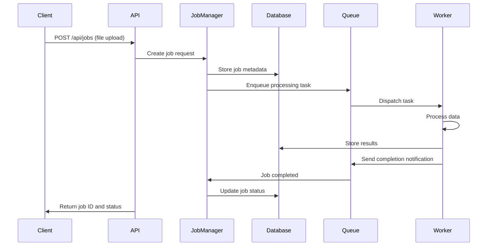
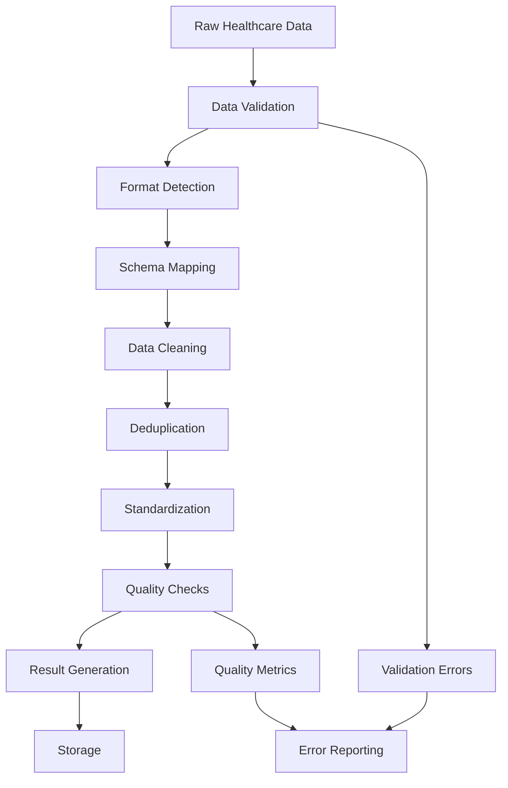

# Architecture Guide
## Distributed Mini Data Harmonizer

### System Overview

The Distributed Mini Data Harmonizer is designed as a microservices architecture that separates concerns between orchestration (Python) and data processing (Go). This design enables scalability, maintainability, and optimal resource utilization.

```
┌─────────────────────────────────────────────────────────────────┐
│                        Client Layer                             │
├─────────────────────────────────────────────────────────────────┤
│         curl/Postman        │        Python Scripts             │
└─────────────────────────────┬───────────────────────────────────┘
                              │
                              ▼
┌─────────────────────────────────────────────────────────────────┐
│                   Python API Server                            │
│                       (FastAPI)                                │
├─────────────────────────────────────────────────────────────────┤
│  ┌─────────────┐  ┌─────────────┐  ┌─────────────┐             │
│  │   REST API  │  │ Job Manager │  │ File Handler│             │
│  └─────────────┘  └─────────────┘  └─────────────┘             │
└─────────────────────┬───────────────────┬───────────────────────┘
                      │                   │
                      ▼                   ▼
┌─────────────────────────────────────────────────────────────────┐
│                    Go Worker Service                           │
│                   (HTTP Server)                                │
├─────────────────────────────────────────────────────────────────┤
│  ┌─────────────┐  ┌─────────────┐  ┌─────────────┐             │
│  │  Processor  │  │  Validator  │  │ Harmonizer  │             │
│  └─────────────┘  └─────────────┘  └─────────────┘             │
└─────────────────────┬───────────────────────────────────────────┘
                      │
                      ▼
┌─────────────────────────────────────────────────────────────────┐
│                    Local Storage                                │
├─────────────────────────────────────────────────────────────────┤
│  ┌─────────────┐  ┌─────────────┐                               │
│  │   SQLite    │  │ File System │                               │
│  │ (Metadata)  │  │ (Results)   │                               │
│  └─────────────┘  └─────────────┘                               │
└─────────────────────────────────────────────────────────────────┘
```

### Technology Stack

#### Core Technologies
- **Python 3.8+**: REST API and job orchestration with FastAPI
- **SQLAlchemy**: ORM for database operations
- **Pydantic**: Data validation and settings management
- **Go 1.19+**: Concurrent data processing with worker pools
- **SQLite**: Local database for job metadata
- **File System**: Local storage for input/output files

#### Frameworks and Libraries
- **Python**:
  - Flask: Simple REST API framework
  - sqlite3: Built-in database driver
  - requests: HTTP client for Go worker communication
  - pytest: Testing framework

- **Go**:
  - net/http: Built-in HTTP server
  - encoding/json: JSON processing
  - encoding/csv: CSV file handling
  - sync: Concurrency primitives

#### Development Tools
- **Git**: Version control
- **Make**: Build automation (optional)
- **Basic logging**: Simple file-based logging

### Component Architecture

#### 1. Python Orchestrator

**Responsibilities:**
- HTTP API endpoint management
- Job lifecycle management
- Database operations
- Authentication and authorization
- Rate limiting and throttling

**Key Components:**

```python
# API Layer
app/
├── api/
│   ├── routes/
│   │   ├── jobs.py          # Job management endpoints
│   │   ├── health.py        # Health check endpoints
│   │   └── metrics.py       # Metrics endpoints
│   └── middleware/
│       ├── auth.py          # Authentication middleware
│       └── rate_limit.py    # Rate limiting middleware

# Business Logic Layer
├── services/
│   ├── job_service.py       # Job orchestration logic
│   ├── worker_service.py    # Worker communication
│   └── file_service.py      # File handling logic

# Data Layer
├── models/
│   ├── job.py              # Job data model
│   ├── user.py             # User data model
│   └── result.py           # Result data model

# Configuration
└── config/
    ├── settings.py         # Application settings
    └── database.py         # Database configuration
```

#### 2. Go Worker Service

**Responsibilities:**
- High-performance data processing
- Concurrent file handling
- Data validation and transformation
- Result generation and storage

**Key Components:**

```go
// Service Architecture
cmd/
└── worker/
    └── main.go             // Application entry point

internal/
├── api/
│   ├── handlers/
│   │   ├── process.go      // Processing endpoints
│   │   └── health.go       // Health check endpoints
│   └── middleware/
│       └── logging.go      // Request logging

├── services/
│   ├── processor.go        // Core processing logic
│   ├── validator.go        // Data validation
│   └── harmonizer.go       // Data harmonization

├── models/
│   ├── request.go          // Request models
│   ├── response.go         // Response models
│   └── data.go             // Data models

└── utils/
    ├── concurrent.go       // Concurrency utilities
    ├── file.go             // File handling utilities
    └── metrics.go          // Metrics collection
```

### Data Flow

#### 1. Job Submission Flow



#### 2. Data Processing Flow



### Concurrency Model

#### Go Worker Concurrency

The Go worker implements a producer-consumer pattern with bounded concurrency:

```go
type WorkerPool struct {
    workers    int
    jobQueue   chan Job
    resultChan chan Result
    quit       chan bool
}

func (wp *WorkerPool) Start() {
    for i := 0; i < wp.workers; i++ {
        go wp.worker(i)
    }
}

func (wp *WorkerPool) worker(id int) {
    for {
        select {
        case job := <-wp.jobQueue:
            result := processJob(job)
            wp.resultChan <- result
        case <-wp.quit:
            return
        }
    }
}
```

**Concurrency Features:**
- Bounded worker pool (configurable size)
- Graceful shutdown handling
- Context-based cancellation
- Resource cleanup on completion

#### Python Orchestrator Concurrency

The Python service uses async/await for I/O operations:

```python
import asyncio
from concurrent.futures import ThreadPoolExecutor

class JobOrchestrator:
    def __init__(self, max_workers=10):
        self.executor = ThreadPoolExecutor(max_workers=max_workers)
    
    async def process_job_async(self, job_id: str):
        loop = asyncio.get_event_loop()
        result = await loop.run_in_executor(
            self.executor, 
            self.process_job_sync, 
            job_id
        )
        return result
```

### Database Design

#### Entity Relationship Diagram

```
┌─────────────────┐     ┌─────────────────┐     ┌─────────────────┐
│      Users      │     │      Jobs       │     │    Results      │
├─────────────────┤     ├─────────────────┤     ├─────────────────┤
│ id (PK)         │────┐│ id (PK)         │────┐│ id (PK)         │
│ username        │    ││ user_id (FK)    │    ││ job_id (FK)     │
│ email           │    ││ status          │    ││ file_path       │
│ created_at      │    ││ file_path       │    ││ metrics         │
│ updated_at      │    ││ operation_type  │    ││ created_at      │
└─────────────────┘    ││ created_at      │    │└─────────────────┘
                       ││ updated_at      │    │
                       ││ completed_at    │    │
                       │└─────────────────┘    │
                       └───────────────────────┘

┌─────────────────┐     ┌─────────────────┐
│   Job_Logs      │     │   Metrics       │
├─────────────────┤     ├─────────────────┤
│ id (PK)         │     │ id (PK)         │
│ job_id (FK)     │     │ job_id (FK)     │
│ level           │     │ processing_time │
│ message         │     │ file_size       │
│ timestamp       │     │ records_count   │
└─────────────────┘     │ errors_count    │
                        │ timestamp       │
                        └─────────────────┘
```

#### Schema Definitions

```sql
-- Jobs table
CREATE TABLE jobs (
    id UUID PRIMARY KEY DEFAULT gen_random_uuid(),
    user_id UUID REFERENCES users(id),
    status VARCHAR(20) NOT NULL DEFAULT 'pending',
    file_path VARCHAR(500) NOT NULL,
    operation_type VARCHAR(50) NOT NULL,
    created_at TIMESTAMP DEFAULT CURRENT_TIMESTAMP,
    updated_at TIMESTAMP DEFAULT CURRENT_TIMESTAMP,
    completed_at TIMESTAMP
);

-- Results table
CREATE TABLE results (
    id UUID PRIMARY KEY DEFAULT gen_random_uuid(),
    job_id UUID REFERENCES jobs(id),
    file_path VARCHAR(500) NOT NULL,
    metrics JSONB,
    created_at TIMESTAMP DEFAULT CURRENT_TIMESTAMP
);

-- Indexes for performance
CREATE INDEX idx_jobs_status ON jobs(status);
CREATE INDEX idx_jobs_created_at ON jobs(created_at);
CREATE INDEX idx_results_job_id ON results(job_id);
```

### API Design

#### RESTful Endpoints

```yaml
# Job Management
POST   /api/v1/jobs              # Create new job
GET    /api/v1/jobs              # List jobs (with pagination)
GET    /api/v1/jobs/{id}         # Get job details
DELETE /api/v1/jobs/{id}         # Cancel/delete job
GET    /api/v1/jobs/{id}/status  # Get job status
GET    /api/v1/jobs/{id}/result  # Download result file
GET    /api/v1/jobs/{id}/logs    # Get job logs

# Health and Monitoring
GET    /api/v1/health            # Health check
GET    /api/v1/metrics           # Prometheus metrics
GET    /api/v1/version           # API version info

# Worker Management (Internal)
POST   /internal/workers/process # Process job (Go worker endpoint)
GET    /internal/workers/health  # Worker health check
```

#### Request/Response Formats

```json
// Job Creation Request
{
  "file": "multipart/form-data",
  "operation": "harmonize",
  "options": {
    "remove_duplicates": true,
    "standardize_fields": true,
    "validate_schema": true
  }
}

// Job Status Response
{
  "job_id": "123e4567-e89b-12d3-a456-426614174000",
  "status": "processing",
  "progress": 75,
  "created_at": "2024-01-15T10:30:00Z",
  "estimated_completion": "2024-01-15T10:35:00Z",
  "metrics": {
    "records_processed": 7500,
    "total_records": 10000,
    "errors_found": 12
  }
}
```

### Security Considerations

#### Authentication & Authorization
- JWT-based authentication
- Role-based access control (RBAC)
- API key authentication for service-to-service communication

#### Data Protection
- File encryption at rest
- TLS encryption in transit
- Input validation and sanitization
- SQL injection prevention

#### Network Security
- Internal service communication over private networks
- Rate limiting and DDoS protection
- CORS configuration for web clients

### Performance Optimization

#### Caching Strategy
- Redis for frequently accessed job status
- In-memory caching for configuration data
- CDN for static assets (if web UI present)

#### Database Optimization
- Connection pooling
- Query optimization with proper indexing
- Read replicas for scaling read operations
- Partitioning for large datasets

#### Resource Management
- Configurable worker pool sizes
- Memory limits and garbage collection tuning
- File streaming for large uploads
- Async I/O for network operations

### Monitoring and Observability

#### Metrics Collection
```go
// Go metrics
var (
    jobsProcessed = prometheus.NewCounterVec(
        prometheus.CounterOpts{
            Name: "jobs_processed_total",
            Help: "Total number of jobs processed",
        },
        []string{"status"},
    )
    
    processingDuration = prometheus.NewHistogramVec(
        prometheus.HistogramOpts{
            Name: "job_processing_duration_seconds",
            Help: "Time spent processing jobs",
        },
        []string{"operation_type"},
    )
)
```

#### Logging Strategy
- Structured logging with correlation IDs
- Log levels: DEBUG, INFO, WARN, ERROR
- Centralized log aggregation
- Log retention policies

#### Health Checks
- Liveness probes for container orchestration
- Readiness probes for load balancer integration
- Dependency health checks (database, queue)

### Deployment Architecture

#### Development Environment
```yaml
# docker-compose.yml
version: '3.8'
services:
  api:
    build: ./python-api
    ports:
      - "8080:8080"
    depends_on:
      - database
      - redis
  
  worker:
    build: ./go-worker
    ports:
      - "8081:8081"
    depends_on:
      - database
  
  database:
    image: postgres:13
    environment:
      POSTGRES_DB: harmonizer
      POSTGRES_USER: admin
      POSTGRES_PASSWORD: password
  
  redis:
    image: redis:6-alpine
```

#### Production Considerations
- Container orchestration (Kubernetes/Docker Swarm)
- Load balancing and auto-scaling
- Database clustering and replication
- Backup and disaster recovery
- CI/CD pipeline integration

### Design Decisions

#### Why Go for Workers?
1. **Performance**: Superior performance for CPU-intensive tasks
2. **Concurrency**: Built-in goroutines and channels
3. **Memory Efficiency**: Lower memory footprint than Python
4. **Static Typing**: Better error detection at compile time

#### Why Python for Orchestration?
1. **Ecosystem**: Rich ecosystem for web APIs and data handling
2. **Productivity**: Faster development for business logic
3. **Integration**: Better integration with data science tools
4. **Flexibility**: Dynamic typing for rapid prototyping

#### Database Choice
- **SQLite**: Development and small deployments
- **PostgreSQL**: Production deployments requiring ACID compliance
- **JSON columns**: Flexible schema for metrics and configuration

### Scalability Patterns

#### Horizontal Scaling
- Stateless service design
- Load balancer distribution
- Database read replicas
- Worker pool scaling

#### Vertical Scaling
- Resource optimization
- Memory and CPU tuning
- Connection pool sizing
- Cache sizing

This architecture provides a solid foundation for a distributed data harmonization system that can scale from development to production environments while maintaining performance, reliability, and maintainability.
